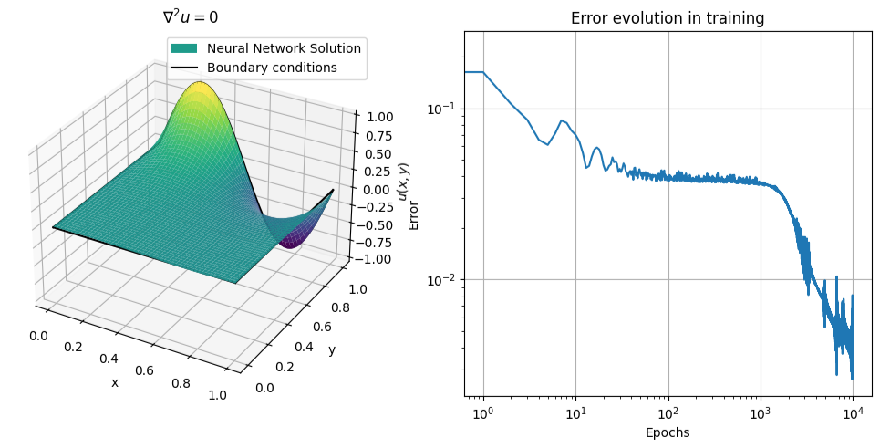

# Machine Learning the atom

The point of this project is to explore the utility of neural networks as approximators for the solutions of differential equations. Through an appropriately selected loss function, and via an unsupervised learning procedure, I am able to approximate the differential equation solution in all of the cases presented below.

This work here is inspired by [1]. I explore ordinary differential equations (ODEs) and partial differential equations (PDEs).

## Architecture

The architecture is a feed-forward deep neural network. Currently, all network implementations have a fixed number of hidden layers (3) and a constant width, with an appropriate input size depending on the application. The activation functions used are always the hyperbolic tangent $\tanh(x)$, and biases are always used.

## 1. Ordinary differential equations


A simple application is to solve a 1D ordinary differential equation. Here we chose

$$
\hat{L} u = 0,
$$

with

$$
\hat{L} = \frac{d}{dx} + 1,
$$

which has a known general solution

$$
u(x) = A e^{-x}
$$

I implement a network with a width of 5. The Adam optimiser is selected. An initial condition needs to be chosen to uniquely identify the ODE solution. 

$$
u(0) = a
$$

Then, the network is fed a vector $\vec{x}\in R^N,  x_i\in[0,1]$ and the loss function is recursively minimised.

The loss function is written as

$$
f(\vec{x}) = \left[u(0)-a\right]^2 + \sum_{i=1}^N  \left[\hat{L}u(x_i) \right]^2
$$

## 2. Partial differential equations

### 2.1 - Laplace equation



The Laplace equation in 2D is an another relatively easy application.

$$
\nabla ^2 u(x,y) = 0
$$

This time we also need to specify the boundary conditions as well. In general, we need to specify 4 functions for the boundaries of the domain that we need to solve our equation in. In Cartesian coordinates , that is $(x,y)\in R^2  : x,y\in [0,1] $. 

We can write the boundary conditions as:

$$
u(\vec b_1) = g_1( x), u(\vec b_2) = g_2(x)
$$

$$
u(\vec b_3) = g_3(x), u(\vec b_4) = g_4(x).
$$

where $\vec b_i$ denote the 4 boundaries

$$
\vec b_1 = \{(x, 0)\in R^2 : x\in [0,1] \}
$$

$$
\vec b_2 = \{(0, x)\in R^2 : x\in [0,1] \}
$$

$$
\vec b_3 = \{(x, 1)\in R^2 : x\in [0,1] \}
$$

$$
\vec b_4 = \{(1, x)\in R^2 : x\in [0,1] \}
$$


For this purpose, I select $N_I$ points in the interior of the domain and $N_B$ points on the boundaries, $N_B/4$ points on each of them. 

The points in the interior and on each of the boundaries are 

$$
z^I_i= (x_i,y_i),\quad i=1,\ldots,N_I 
$$

$$
z^{B,j}_i = (x_i,y_i),\quad i=1,\ldots,N_B/4
$$

Now the loss function can be written as

```math
f(z^I,z^B) = \frac{1-\lambda}{N_B}\sum_{i=1}^{N_B}\sum_{j=1}^4 \left[u(z^{B,j}_i)-g_j(x_i)\right]^2 + \frac{\lambda}{N_I}\sum_{i=1}^{N_I}  \left[\nabla^2 u(z^I_i) \right]^2
```

where the parameter $\lambda$ can be chosen such that for a fixed error, the "distance" of the approximation to the PDE solution is minimised [1].

Here the Adam optimiser is used, and a fixed width of 20 is selected. 

## References

[1] Optimally weighted loss functions for solving PDEs with Neural Networks, [Remco van der Meer](https://arxiv.org/search/math?searchtype=author&query=van+der+Meer,+R), [Cornelis Oosterlee](https://arxiv.org/search/math?searchtype=author&query=Oosterlee,+C), [Anastasia Borovykh](https://arxiv.org/search/math?searchtype=author&query=Borovykh,+A), [[2002.06269]](https://arxiv.org/abs/2002.06269) 
